<h1 align="center">Hi, I'm Daniel</h1>

### About Me

- Husband and father
- I enjoy chess, sci-fi/fantasy books, and playing guitar
- Connect with me on [LinkedIn](https://linkedin.com/in/dannylongeuay)

### GitHub Stats

  
  

### Pinned Repositories

  
  

  
  

### On This Day in History

> **1915** - The Battle of Neuve Chapelle, the first deliberately planned British offensive of the First World War, began. ([Read more](https://en.wikipedia.org/wiki/Battle_of_Neuve-Chapelle))

### LeetCode Daily Challenge

| Problem | Difficulty |
|---------|------------|
| [Find All Possible Stable Binary Arrays II](https://leetcode.com/problems/find-all-possible-stable-binary-arrays-ii/) | Hard |

Last updated: 2026-03-10 01:16:46 UTC

