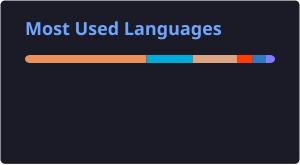

<h1 align="center">Hi, I'm Daniel</h1>

### About Me

- Husband and father
- I enjoy chess, sci-fi/fantasy books, and playing guitar
- Connect with me on [LinkedIn](https://linkedin.com/in/dannylongeuay)

### GitHub Stats

  
  

### Pinned Repositories

  
  

  
  

### On This Day in History

> **1942** - World War II: The Imperial Japanese Army lost the Battle of the Tenaru, the first of its three major land offensives during the Guadalcanal campaign. ([Read more](https://en.wikipedia.org/wiki/World_War_II))

### LeetCode Daily Challenge

| Problem | Difficulty |
|---------|------------|
| [Kth Smallest Amount With Single Denomination Combination](https://leetcode.com/problems/kth-smallest-amount-with-single-denomination-combination/) | Hard |

Last updated: 2026-08-21 00:50:28 UTC

