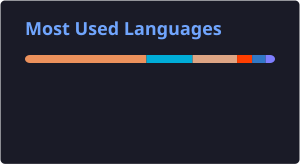

<h1 align="center">Hi, I'm Daniel</h1>

### About Me

- Husband and father
- I enjoy chess, sci-fi/fantasy books, and playing guitar
- Connect with me on [LinkedIn](https://linkedin.com/in/dannylongeuay)

### GitHub Stats

  
  

### Pinned Repositories

  
  

  
  

### On This Day in History

> **1927** - Gutzon Borglum and approximately 400 workers began sculpting Mount Rushmore. ([Read more](https://en.wikipedia.org/wiki/Gutzon_Borglum))

### LeetCode Daily Challenge

| Problem | Difficulty |
|---------|------------|
| [Valid Parenthesis String](https://leetcode.com/problems/valid-parenthesis-string/) | Medium |

Last updated: 2026-10-04 03:36:24 UTC

